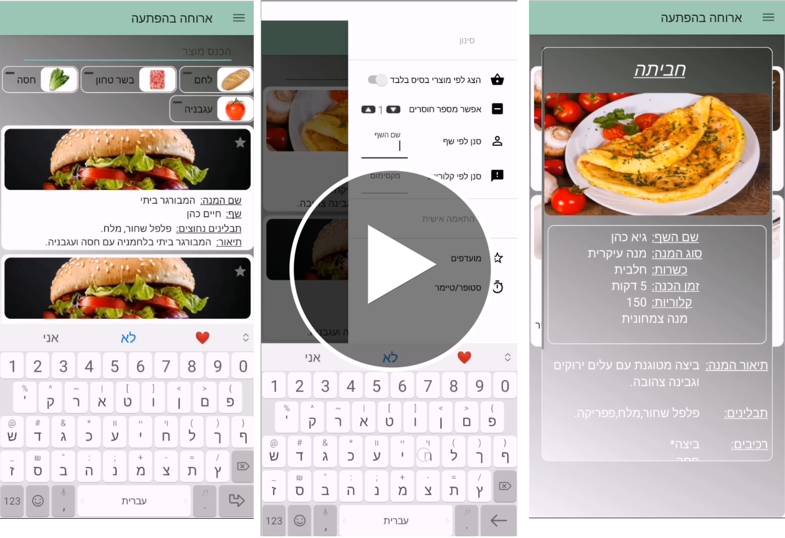
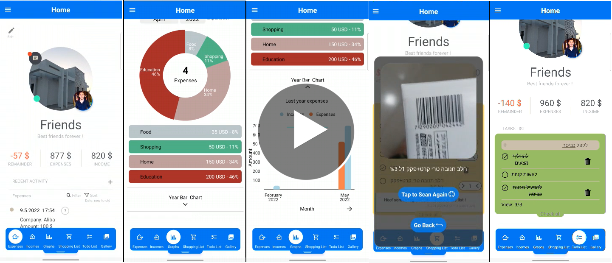

 <a href="https://github.com/Guyco070/Guyco070#hi-there-im-guy-cohen-and-i-just-graduated-with-a-bachelors-degree-in-software-engineering">About Me</a>&nbsp;&nbsp;&nbsp;|&nbsp;&nbsp;&nbsp;
 <a href="https://github.com/Guyco070/Guyco070#languages-and-tools">Languages and Tools</a>&nbsp;&nbsp;&nbsp;|&nbsp;&nbsp;&nbsp;
 <a href="https://github.com/Guyco070/Guyco070#repositories">My Special Repositories</a>&nbsp;&nbsp;&nbsp;|&nbsp;&nbsp;&nbsp;
 <a href="https://github.com/Guyco070/Guyco070/blob/main/README.md#udemy-courses">Udemy Courses</a>

#

 
 

    
    
  

## Hi there, I'm Guy Cohen and I just graduated with a bachelor's degree in software engineering.

### Experienced in object-oriented programming in different languages, use in different work environments and more.

### Always willing to learn new things and experienced in self-learning.

<!-- - 🔭 Check out my VS Code course: [Become A VS Code SuperHero!][course]! -->

- 🥅 2023 Goals: Find my first job as a software engineer and enjoy it.

- 🌱 Fun fact: I love plants.

<!-- ### Connect with me:

&nbsp;&nbsp;

&nbsp;&nbsp;

&nbsp;&nbsp;

&nbsp;&nbsp;

 -->

## Languages and Tools:

### IDEs:

 

### Programming Languages:

 

### Frontend Development:

 

### Backend Development:

 

### Frameworks:

 

### Project management technologies:

<!--  -->

 

### Databases:

<!-- 
XML -->
<!--  -->

##  

## Repositories

    
 2019 - Workplace entry system through facial recognition with visionimpairment access (Visual Studio Code – Python – OpenCv - MeisterTask) 

 

&nbsp;&nbsp;

 2019 - Food recipes from products - Android app (Android Studio – Firebase - Java and XML) – No partners 

 

&nbsp;&nbsp;

 2020 - Driving Simulator Project – Java (Advanced OOP courseproject with multi-threading and some design patterns) 

 

 2020 - Cinema website (ASP.NET, SQL Server – C#, SQL, HTML, CSS, Java Script) 

 

 2021 - Website for managing a project in an agile environment with a Kanban board (Django - Python, HTML, CSS, MongoDB) 

 

&nbsp;&nbsp;

 2021 - 2022 - Final project – HomEco – Home budget management app (React Native, firebase) 

 

&nbsp;&nbsp;

 
 

 2022 - Donation Finder – Web application - Add a donation place or find the closest donation place to donate or take a donation. (React, Node.js, Express, Google API) 

 

&nbsp;&nbsp;

  
### Backend Development:

  
### Frontend Development:

  

 
 

 2023 - Kodesh – IOS/ Android smartphone application. (Flutter and Dart)

The application was developed to help its users who want to know the entry and exit times of Shabbats and Jewish holidays, Jewish times of the day, and more by logging in or by receiving notifications as the users wish.
It is also possible to set notifications for additional reminders, for example, reminders to put on tefillin.
 

&nbsp;&nbsp;

 
<h4> * Some of the projects are still in development and will be updated soon... :technologist:</h5>
<h4> * Scroll down for more</h4>

---
## Udemy Courses
  

 

---
 
:zap: GitHub Stats

  

 

<!-- [website]: https://codeSTACKr.com
[course]: http://vsCodeHero.com
[twitter]: https://twitter.com/codeSTACKr
[youtube]: https://youtube.com/codeSTACKr
[instagram]: https://instagram.com/codeSTACKr
[linkedin]: https://linkedin.com/in/codeSTACKr
[webdevplaylist]: https://www.youtube.com/playlist?list=PLkwxH9e_vrAJ0WbEsFA9W3I1W-g_BTsbt
[jsplaylist]: https://www.youtube.com/playlist?list=PLkwxH9e_vrALRJKu7wfXby3MKeflhTu6B
[cssplaylist]: https://www.youtube.com/playlist?list=PLkwxH9e_vrALSdvZuEh6gqQdmDoDIoqz4
[reactplaylist]: https://www.youtube.com/playlist?list=PLkwxH9e_vrAK4TdffpxKY3QGyHCpxFcQ0 -->
